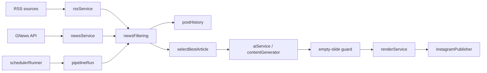

# Architecture — full system

**Project:** `instagram-content-generator-remotion`  
**Role:** Automated content pipeline: ingest news → filter/dedup → AI (Gemini) → Remotion render → Instagram (Playwright). Express serves renders, health, and scheduler when enabled.

---

## High-level data flow

1. **Ingestion:** `USE_RSS_FEEDS !== 'false'` → `fetchRssNews` (registry, Redis cooldown, cross-source dedup, telemetry to Postgres). On failure or empty relevant set → `fetchTopNews` / `fetchSearchNews` (GNews, Redis cache).
2. **Filter / rank:** `filterAndRankArticles` — `hasBeenPosted` (URL + title trigram fingerprint), repetitive-topic skip, keyword scoring vs `MIN_RELEVANCE_SCORE`.
3. **Selection:** `selectBestArticle` with `top` or `diverse` (random pick among top 3).
4. **Early dedup record:** `recordPost(article, batchId-pre-gen)` with **original** title/URL so Gemini rewrites still match history.
5. **AI:** `generateContent` → Gemini 2.5 Flash; manifest validation without rigid JSON schema in model (avoids empty objects).
6. **Safety:** abort if any slide has empty `data` after generation.
7. **Render:** in-process `renderManifest` (PNG/MP4) to `/tmp/renders` (or Windows path in pipeline).
8. **Publish:** `publishToInstagram` (Playwright, session from `storage.json` / `INSTAGRAM_SESSION_B64`).

---

## Tech stack

| Layer | Technology |
|--------|------------|
| Runtime | Node ESM, `tsx` for dev, optional `tsc` + `node dist/server.js` for production |
| API | Express — `/api/render`, static `/api/renders/`, health, scheduled pipeline hook |
| Video | Remotion 4, `@remotion/bundler` / `renderer` |
| LLM | `@google/generative-ai`, `GEMINI_API_KEY` |
| News | GNews v4, `rss-parser` + `sanitize-html` + `he` |
| Browser automation | Playwright (Instagram) |
| Cache / locks | Redis — GNews cache, RSS source cooldown, `schedulerLock` for pipeline |
| Durable store | PostgreSQL — RSS run/source telemetry (`rssTelemetryStore`); post history is still **file JSON** (see current-state) |
| Deploy | Docker, Railway; env via `.env` / platform |

---

## Key paths

| Path | Role |
|------|------|
| `server.ts` | Express, scheduler, `bootstrapInstagramSession`, render imports |
| `src/pipelineRun.ts` | End-to-end pipeline (CLI and invoked from scheduler) |
| `src/pipeline/schedulerRunner.ts` | Posting window, `shouldRunNow`, distributed lock, `runPipeline` |
| `src/pipeline/postHistory.ts` | Posted URL + `titleFingerprint`, JSON file, cap 500 |
| `src/utils/titleFingerprint.ts` | Trigram fingerprint + similarity for dedup |
| `src/pipeline/newsFiltering.ts` | Scoring, dedup, `selectBestArticle` |
| `src/pipeline/rssService.ts` | Fetch, normalize, image extraction, title dedup threshold |
| `src/pipeline/rssTelemetryStore.ts` | Postgres + Redis for RSS health |
| `src/render/renderService.ts` | Bundle cache, `validateRenderManifest`, Remotion still/media |
| `src/pipeline/aiService.ts` | Gemini calls, response parse/validate |
| `src/automation/instagramPublisher.ts` | Session + publish |
| `__tests__/` | Vitest + Supertest |

---

## External integrations

- **n8n / HTTP callers:** POST `/api/render` with manifest; optional `webhookUrl` for async. Field names must match `context/templates.md`.
- **GNews:** query param `apikey` today — see `memory/current-state.md` and SEC-03.
- **ClickUp / Railway:** no ClickUp MCP in repo `.cursor/mcp.json` (Railway only); task tracking is external.

---

## Composition (Remotion)

- Composition id: `Slide` (see `context/remotion.md`).
- 1080×1080, fps/duration from env (`COMPOSITION_FPS`, `COMPOSITION_DURATION_SECONDS` where applicable).

---

## Development

- `npm run dev` — `tsx server.ts`
- `npm run pipeline` — one pipeline run
- `npm test` / `npx vitest` — see `rules/testing-standards.md`

*Legacy note:* an older version of this file described only “render + n8n”. The sections above are the current full automation architecture.
